# Business Object Bible

> **The definitive dictionary of every first-class business object in Yugrow.**
>
> Every engineer, AI agent, product manager, and future employee must use the same definitions.
>
> If the Platform Constitution defines the **laws**, this document defines the **language**.

---

## How to Read This Document

Each business object has:

| Section | Description |
|---------|-------------|
| **Definition** | What is it? One clear sentence. |
| **Owner** | Which engine or platform is the source of truth. |
| **Permanent vs Temporary** | Which fields persist and which are ephemeral. |
| **Lifecycle** | The state machine this object follows. |
| **Relationships** | How this object connects to other business objects. |
| **Key Rules** | Non-negotiable constraints. |

---

## Person

| Attribute | Value |
|-----------|-------|
| **Definition** | A human identity that can own workspaces, participate in events, create relationships, and receive opportunities. |
| **Owner** | Identity Engine |
| **Permanent** | Name, email (verified), authentication credentials, global unique ID |
| **Temporary** | Session, current workspace, availability status, location sharing |

### Lifecycle

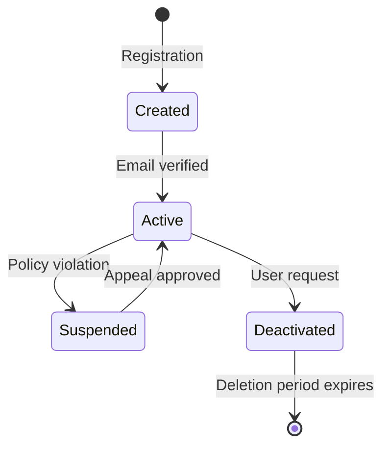

### Key Rules
- One person = one identity. No duplicate accounts.
- A person can be a member of multiple workspaces.
- A person's skills and industries are permanent attributes that change rarely.

---

## Workspace

| Attribute | Value |
|-----------|-------|
| **Definition** | A business context (Personal, Company, Brand, Community, Event) where products operate and data is scoped. |
| **Owner** | Workspace Engine |
| **Permanent** | Name, type, owner, created date |
| **Temporary** | Plan tier, feature flags, branding, member list (changes over time) |

### Lifecycle

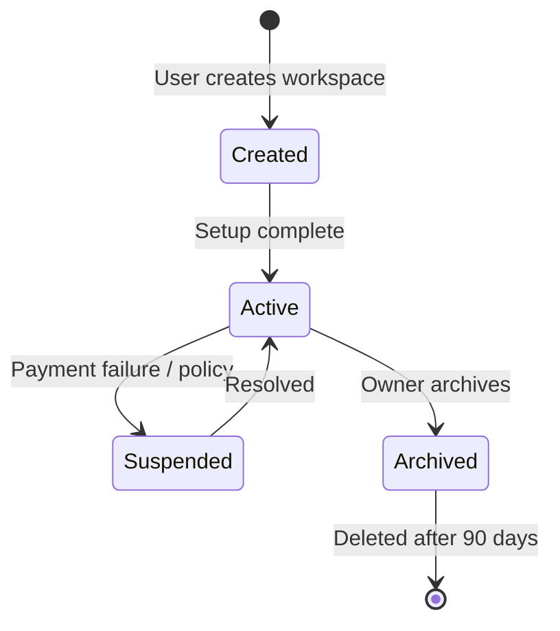

### Key Rules
- Every action carries an Actor Context: Person + Active Workspace.
- Workspaces isolate data. Cross-workspace interactions require explicit permission.
- Workspace type determines available products and default capabilities.

---

## Venue

| Attribute | Value |
|-----------|-------|
| **Definition** | A permanent physical location where business events occur. Never expires. Built by user contributions. |
| **Owner** | Presence Platform |
| **Permanent** | Name, address, coordinates, unique ID |
| **Temporary** | Photos, capacity estimates, categories (can be updated) |

### Lifecycle

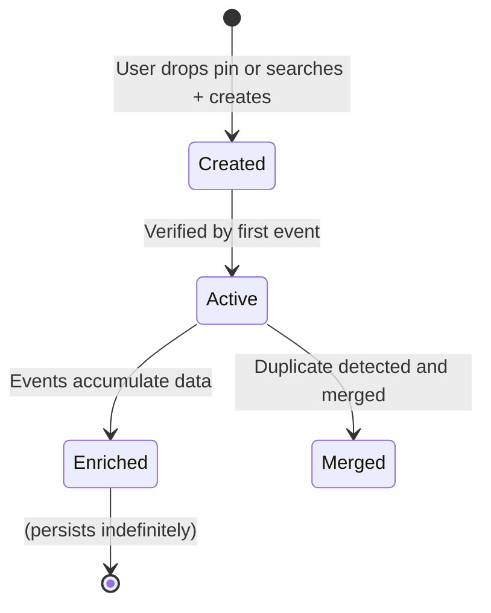

### Key Rules
- No duplicate venues. Search first, create on pin-drop if not found.
- Venue outlives all events held there.
- Over time, venues accumulate: event history, companies attended, industries represented, connections created, opportunity density.
- Venue is a referenceable business object — other engines can query it.

---

## Event

| Attribute | Value |
|-----------|-------|
| **Definition** | A temporary, time-bound gathering at a venue with defined organizers, participants, and lifecycle. Created by any user. |
| **Owner** | Presence Platform |
| **Permanent** | Venue association, historical record |
| **Temporary** | Name, date/time, description, categories, attendee list, contexts |

### Lifecycle

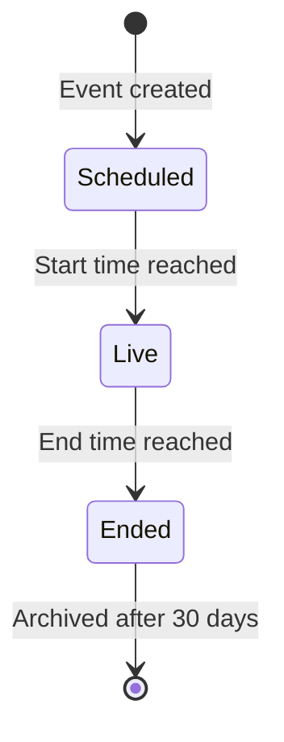

### Key Rules
- Event expires. Venue does not.
- Anyone can create an event — no organizer approval needed.
- Event categories help with discovery but do not imply attendee expertise.

---

## Context (Attendee Role)

| Attribute | Value |
|-----------|-------|
| **Definition** | A per-event, per-attendee role that determines how a person participates and what they see. |
| **Owner** | Presence Platform |
| **Permanent** | (none — always tied to a specific event) |
| **Temporary** | Role (Visitor, Exhibitor, Speaker, Sponsor, Media, Organizer, VIP Buyer) |

### Lifecycle

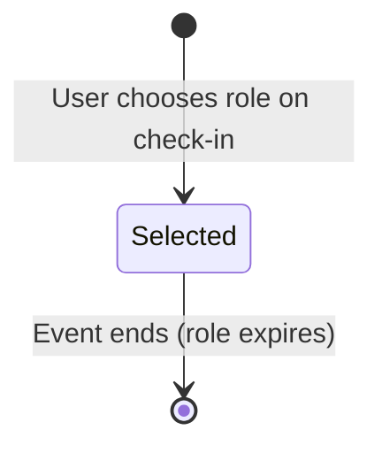

### Key Rules
- Context is always paired with a Presence.
- Context determines visibility, filtering, and recommended connections.
- Exhibitor context unlocks additional fields: booth number, hall, products, demos.

---

## Presence

| Attribute | Value |
|-----------|-------|
| **Definition** | A temporary declaration that a person is currently participating at an event in a specific context. |
| **Owner** | Presence Platform |
| **Permanent** | (none — always temporary) |
| **Temporary** | Event, context, intent (looking for), availability, objective, visibility, status |

### Lifecycle

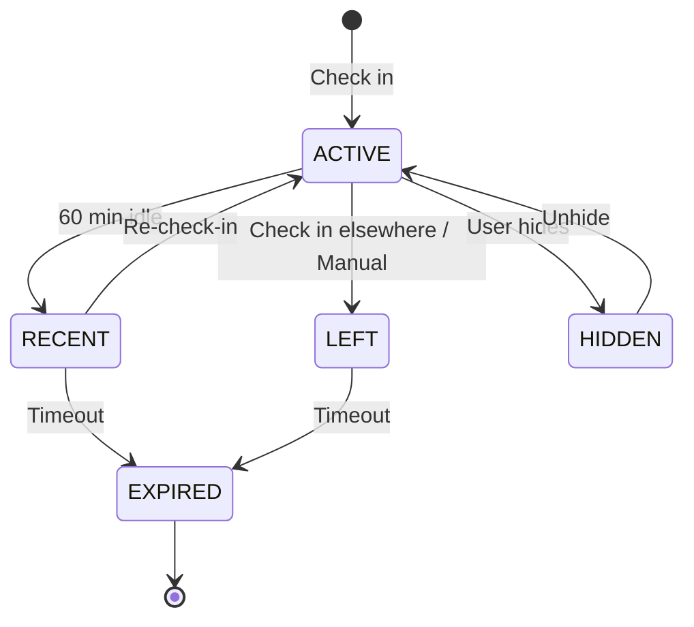

### Key Rules
- Presence is always tied to an Event + Context.
- No checkout button. Presence auto-expires.
- Presence creates visibility in the Live tab during its window.
- Relationship created during presence outlives the presence.

---

## Relationship

| Attribute | Value |
|-----------|-------|
| **Definition** | A permanent connection between two entities (people or organizations) created after mutual acceptance. |
| **Owner** | Relationship Engine |
| **Permanent** | Connection record, created date, source event |
| **Temporary** | Strength, trust signals, communication frequency, context tags |

### Lifecycle

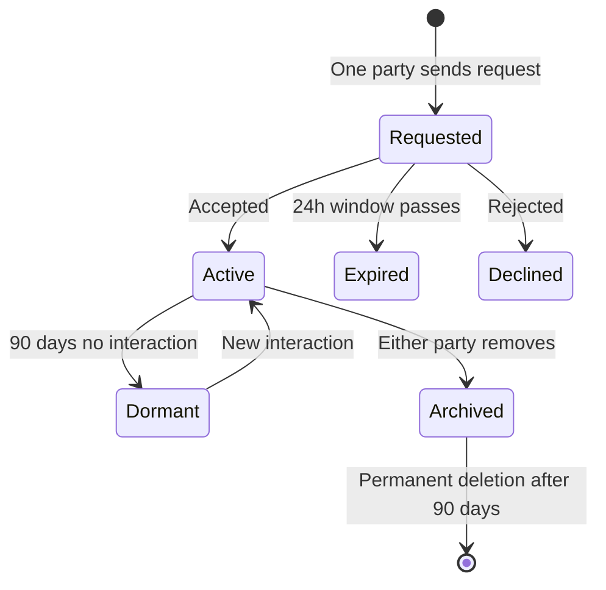

### Key Rules
- Created by mutual acceptance only.
- A relationship is the foundational permission to communicate.
- Relationship outlives the event, venue, and presence that created it.
- Relationships are permanent unless explicitly removed by either party.

---

## TrustEvidence

| Attribute | Value |
|-----------|-------|
| **Definition** | An immutable record of observed or declared evidence about a person's professional capabilities, reliability, or reputation. |
| **Owner** | Trust Evidence Engine |
| **Permanent** | Evidence record, type, issuer, timestamp (immutable — never edited) |
| **Temporary** | Status (Active, Revoked, Expired) |

### Lifecycle

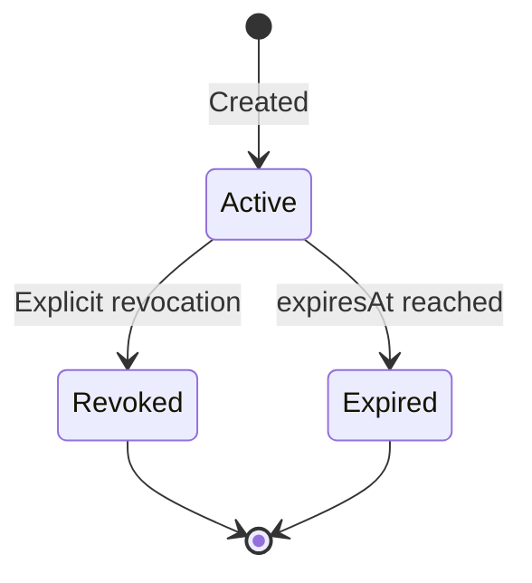

### Key Rules
- **Immutable.** Once created, evidence cannot be edited. Only Created → Revoked → Expired transitions.
- Revocations create a new record referencing the original.
- `isVerified` is set once during verification and never changed.
- Event attendance must never be used as evidence of expertise.

---

## Conversation

| Attribute | Value |
|-----------|-------|
| **Definition** | A contextual message thread between two or more entities, typically initiated by a relationship. |
| **Owner** | Communication Engine |
| **Permanent** | Thread record, participants, created date |
| **Temporary** | Messages, read status, attachments |

### Lifecycle

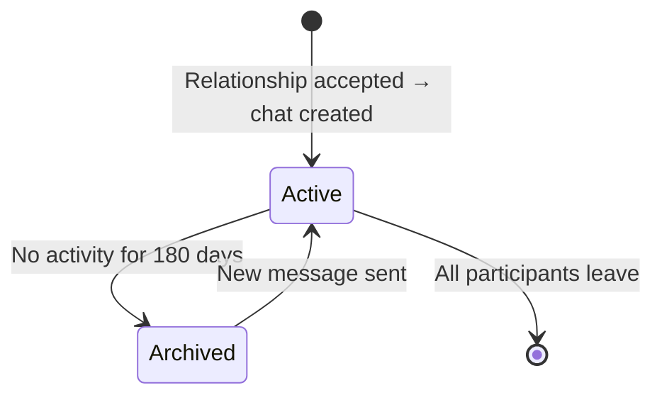

### Key Rules
- Messaging is unlocked **only** after a relationship is accepted.
- Conversation context (event + intent) is preserved in the thread.
- Conversations can span multiple events but are scoped to the relationship.

---

## Opportunity

| Attribute | Value |
|-----------|-------|
| **Definition** | A business request, offer, requirement, or announcement distributed through the Broadcast platform. |
| **Owner** | Opportunity Engine (Broadcast) |
| **Permanent** | Archived record, outcome, created date |
| **Temporary** | Status, distribution scope, expiry, responses |

### Lifecycle

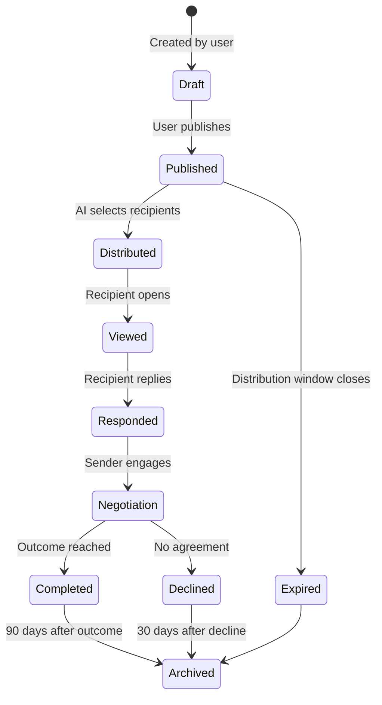

### Key Rules
- Distribution is driven by **skills, intent, industry, and geographic scope** — NOT by event attendance.
- Platform Law: Event attendance ≠ expertise. This is non-negotiable.
- Every opportunity includes an **explainability statement**: "You're seeing this because..."
- Opportunity Radius: Connections → Event Attendees → Venue → City → State → Country → Global.

---

## Skill

| Attribute | Value |
|-----------|-------|
| **Definition** | A declared professional capability (e.g., Export, Banking, UI Design, AI). Permanent attribute of a Person. |
| **Owner** | Identity Engine |
| **Permanent** | Skill name, category, proficiency level (self-declared) |
| **Temporary** | Endorsement count, recency evidence |

### Lifecycle

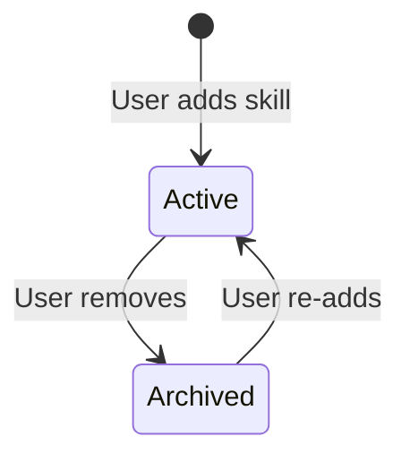

### Key Rules
- Skills are permanent attributes that change rarely.
- Skills are self-declared. TrustEvidence from others can corroborate.
- Skills drive Broadcast matching. Event attendance does not.

---

## Content

| Attribute | Value |
|-----------|-------|
| **Definition** | A published piece of information (blog post, article, page, media) created by a user or AI. |
| **Owner** | Content Platform |
| **Permanent** | Published content, author, created date |
| **Temporary** | Drafts, SEO metadata, scheduled publish dates |

### Lifecycle

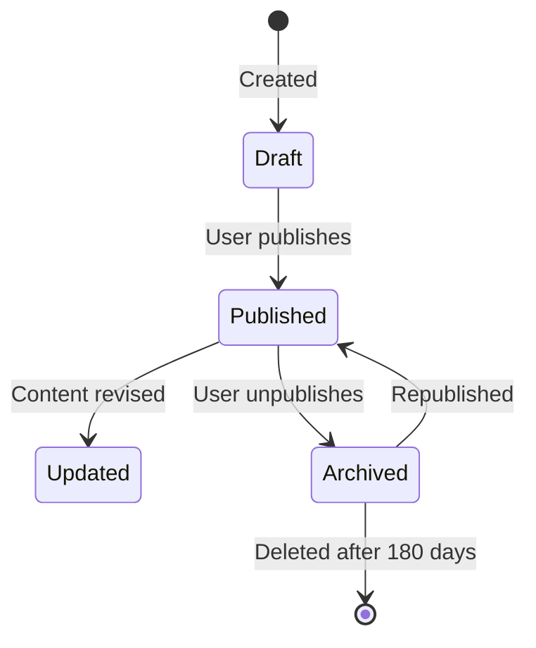

---

## Site

| Attribute | Value |
|-----------|-------|
| **Definition** | A published website owned by a workspace, rendering Content objects. |
| **Owner** | Content Platform |
| **Permanent** | Site record, custom domain, created date |
| **Temporary** | Theme, layout, pages, SEO settings |

---

## Broadcast

| Attribute | Value |
|-----------|-------|
| **Definition** | A single distribution instance of an Opportunity. Contains the delivery, view, and response tracking. |
| **Owner** | Opportunity Engine |
| **Permanent** | Distribution record, recipient list, outcome |
| **Temporary** | Status, remaining credits, response window |

---

## Object Relationship Map

```
Person ── owns ──> Workspace
Person ── has ──> Skill
Person ── declares ──> Presence (at Event via Context)
Person ── creates ──> Relationship (mutual)
Person ── receives ──> TrustEvidence
Person ── authors ──> Content
Person ── receives ──> Opportunity (via Broadcast)

Venue ── hosts ──> Event
Event ── contains ──> Context (roles)
Event + Context ── defines ──> Presence
Presence ── creates ──> Relationship
Relationship ── enables ──> Conversation

Workspace ── owns ──> Site
Site ── renders ──> Content
Content ── published via ──> Broadcast (as Opportunity)
Opportunity ── matched by ──> Skill + Intent + Geography
```

---

## Compounding Assets

> **What data becomes more valuable every day?**

| Asset | Compounds How |
|-------|--------------|
| Relationships | Grow with every new connection across the graph |
| TrustEvidence | Accumulates with every endorsement, reference, and collaboration |
| Venues | Gain history of events, companies, industries, connections, opportunity density |
| Events | Create networks that persist beyond the event date |
| Opportunities | Reveal demand patterns, skill gaps, and market trends over time |
| Skills | Evolve as users add, verify, and demonstrate capabilities |
| Business Intent | Changes constantly — creates a real-time map of market demand |
| Presence | Creates context for every interaction across the platform |

---

> **This Bible is the definitive reference. If two documents disagree, this document wins.**
>
> Every new business object must be added here before it can be referenced in code.
>