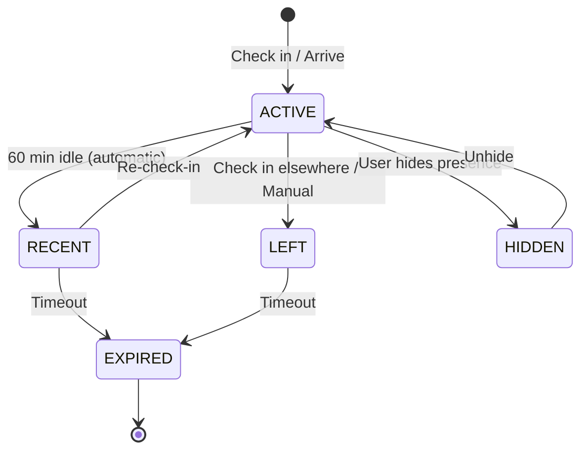

# Minimum Lovable Presence Platform — PRD

> **Product Name:** Yugrow Presence Platform (formerly CheckIN)
> **Version:** 1.1
> **PRD Author:** Founder / CPO
> **Status:** Approved
> **Target Release:** Phase 1
>
> ⚖️ **Platform Law 1:** Event attendance ≠ expertise. A SaaS developer at an agri expo is there to sell software, not because they are in agriculture. Attendance must never be used as a primary signal for opportunity matching, skill inference, or content recommendations.
>
> ⚖️ **Platform Law 2:** Every interaction must reduce friction. If a feature asks users to provide information that can be inferred later or is not essential to the immediate task, the feature should be redesigned.
>
> **Core thesis:** Real-world business networking with immediate digital follow-up. The goal is to **add everyone to the network**. Networking comes first. Business comes later.
>
> CheckIN is one thing: Check in → See people → Connect → Accepted → Chat. Three steps. Under 30 seconds.
>
> **Presence can exist without an event.** This is the key architectural decision. Presence extends beyond conferences to coworking spaces, airports, business centers, coffee shops, university campuses, and any professional environment.

---

## Section 1 — Product Overview

### 1.1 Purpose

The Presence Platform lets professionals **become visible, discover each other, connect, and start conversations** wherever business happens — events, coworking spaces, airports, business districts, or any professional environment.

**CheckIN is one thing:** Check in → See people → Connect → Accepted → Chat. Three steps. Under 30 seconds. No extra questions.

The platform is a **Professional Presence Network**: a permission-based business networking protocol that compresses "exchange cards → find on LinkedIn → send request → hope they respond → follow up" into one seamless flow.

**The goal is to add everyone to the network.** Networking comes first. Business comes later. Skills, goals, and intent are handled by Broadcast and the user's profile — not by CheckIN.

### 1.2 Business Problem

Business networking today is broken:

- Physical business cards get lost or forgotten
- Digital connections require multiple steps (scan → save → find on LinkedIn → request → wait)
- There's no way to know who's in the same room right now and why they're there
- Post-event follow-up rarely happens
- The context of "we met at X" is lost
- Networking is siloed to events — opportunities in airports, coworking spaces, and business centers are missed
- Event organizers can tell you how many tickets they sold but not how much business networking actually happened

The Presence Platform solves this by making **professional presence visible and intentional** everywhere business people gather.

**Key design principle:** CheckIN and Broadcast are separate products with separate matching logic.
- **CheckIN** answers: *"Who is here that I can connect with?"* — driven by presence, venue, and event
- **Broadcast** answers: *"Which business opportunities are relevant to me where I'm currently operating?"* — driven by skills, intent, industry, and geographic scope
- They reinforce each other through relationships and trust, but each has its own primary matching logic

### 1.3 Target Users

| Persona | Why They Need CheckIN |
|---------|----------------------|
| **Event Attendee** | Wants to meet the right people without awkward cold outreach |
| **Exhibitor** | Wants to maximize connections made during the event |
| **Sales Professional** | Wants to identify and connect with prospects in real-time |
| **Consultant** | Wants to expand their network efficiently |
| **Event Organizer** | Wants attendees to get value from networking (indirect beneficiary) |

### 1.4 Success Criteria

| Criterion | Target | Measurement |
|-----------|--------|-------------|
| **North Star** | 3+ Live Discovery Sessions per event attendee | Sessions where user checks in and connects with at least 1 person |
| Connection requests sent | 5+ per active user per event | Request submission count |
| Acceptance rate | ≥60% | Accepted / Sent |
| Time-to-connect | < 30 min from check-in to first request | Average across all users |
| Repeat usage | 40%+ users check in at 2+ events within 90 days | Cohort analysis |

### 1.5 Scope

**Design principle:** CheckIN asks nothing beyond "which workspace?" Everything else is inferred from profile and actions.

| In Scope (v1.0) | Out of Scope (Future) |
|-----------------|----------------------|
| Presence declaration with auto-expiry | Ticketing |
| Live presence list with time filters | Seat maps |
| **"Connect" button** (one tap) | Agenda management |
| 24-hour Connection Window | Speaker management |
| Accept/decline requests | Indoor venue zones |
| Messaging after accepted connection | Push notifications (v1.1) |
| Mutual connections display | Event analytics for organizers (v1.2) |
| Smart connection limits | Office/coworking presence (v1.2) |
| Presence states (ACTIVE, RECENT, LEFT, HIDDEN, EXPIRED) | Airport/business travel presence (v2) |
| Temporary Communities (24h per event) | Broadcast integration (separate product) |
| Presence Score (internal signal) | Permanent communities |
| Anyone can create events (name + venue + date) | Exhibitor features |
| Venue pin-dropping (search → reuse or create) | SDK for third-party apps |
| **Workspace selector** on check-in (Personal / Company A / Company B) | Paid organizer tiers |

### 1.6 Dependencies

| Dependency | Type | Status |
|------------|------|--------|
| Identity Engine | Engine | ✅ Built |
| Relationship Engine | Engine | ✅ Built |
| Trust Evidence Engine | Engine | To build |
| Communication Engine | Engine | To build |
| Journey Engine (Frontend) | UI | ✅ Built |

### 1.7 Risks

| Risk | Likelihood | Impact | Mitigation |
|------|-----------|--------|------------|
| Low initial adoption (empty events) | High | High | Seed with demo data; target first event as launch partner |
| Spam / abuse | Medium | High | Smart limits from day one; blocking/reporting |
| "Dating app" perception | Medium | Medium | Professional intent emphasis; business context everywhere |
| Venue WiFi reliability | Medium | Medium | Offline-capable check-in; sync when connected |
| Event organizer buy-in | Low | Medium | Start with public events; SDK later |

---

## Section 2 — User Personas

### 2.1 Primary Persona: Event Attendee

| Attribute | Description |
|-----------|-------------|
| **Name** | Priya |
| **Role** | Business Development Manager at a logistics company |
| **Company Size** | 50 employees |
| **Technical Level** | Medium |
| **Goals** | Meet 5-10 potential partners at the trade expo; follow up while context is fresh |
| **Frustrations** | Collects 30 cards, loses 15, follows up with 3, converts 0; LinkedIn requests ignored |
| **Frequency of Use** | At events (monthly/quarterly) |
| **Jobs To Be Done** | *"When I'm at a business event, I want to meet relevant people and continue the conversation after, so I don't waste the opportunity."* |

### 2.2 Secondary Persona: Exhibitor

| Attribute | Description |
|-----------|-------------|
| **Name** | Rajesh |
| **Role** | Founder of a SaaS startup with a booth at the expo |
| **Company Size** | 10 employees |
| **Technical Level** | High |
| **Goals** | Connect with every lead who visits the booth; qualify them quickly |
| **Frustrations** | Scanning badges is slow; leads get lost in CRM; no way to prioritize |
| **Frequency of Use** | At events (monthly) |
| **Jobs To Be Done** | *"When I'm exhibiting, I want to capture every lead's intent and contact info instantly, so I can follow up while they remember me."* |

### 2.3 Non-Target Personas

- **Casual social networkers** (no business intent) — not the audience
- **Consumers** — no willingness to pay for business tools
- **Event organizers** (in v1) — they're indirect beneficiaries, not users

---

## Section 3 — User Stories

### 3.0 Epic: Event & Venue Creation

| ID | User Story | Acceptance Criteria | Priority |
|----|-----------|---------------------|----------|
| CI-000 | As any user, I want to create an event so that people can check in and network. | 1. Tap "Create Event" 2. Search for venue 3. If venue exists, select it 4. If not, drop a pin → venue created permanently 5. Set event name, date, description, categories 6. Event appears in listings 7. Anyone can check in | P0 |
| CI-000b | As an event creator, I want to see how many connections were made at my event. | 1. Event dashboard shows: attendees, connections made, acceptance rate, conversations, top industries, peak networking time 2. Data available after event ends | P1 |

### 3.1 Epic: Check-In & Presence

| ID | User Story | Acceptance Criteria | Priority |
|----|-----------|---------------------|----------|
| CI-001 | As an attendee, I want to check in to an event so that others know I'm here. | 1. User selects event from list or searches by name 2. Choose which workspace to act as (Personal / Company A / Company B) 3. One-tap check-in 4. Presence activated immediately 5. User appears in attendee list under the selected workspace identity | P0 |
| CI-002 | As an attendee, I want my presence to expire automatically so I don't have to remember to check out. | 1. Presence auto-expires at configured event end time 2. OR when user checks into a different event 3. No checkout button | P0 |
| CI-003 | As an attendee, I want to check in multiple times so that my presence refreshes throughout the day. | 1. Re-check-in resets presence timer 2. Triggers "just arrived" notification to relevant users | P1 |

### 3.2 Epic: Business Intent

| ID | User Story | Acceptance Criteria | Priority |
|----|-----------|---------------------|----------|
| CI-010 | As an attendee, I want to declare my intent when checking in so that relevant people can find me. | 1. Intent selection during check-in (Find Customers, Hire, Partner, etc.) 2. Custom intent option 3. Intent visible on profile 4. Intent shown in attendee list | P0 |
| CI-011 | As an attendee, I want to update my intent during the event so it stays relevant. | 1. Can change intent from profile 2. Change triggers optional notification to connections | P2 |

### 3.3 Epic: Discovery

| ID | User Story | Acceptance Criteria | Priority |
|----|-----------|---------------------|----------|
| CI-020 | As an attendee, I want to see who checked in recently so I don't miss new arrivals. | 1. Default view: "Last 60 minutes" 2. Time filters: 15min, 30min, 60min, Today, Yesterday 3. Real-time updates as new people check in 4. Sorted by most recently checked in | P0 |
| CI-021 | As an attendee, I want to see people by intent so I can find relevant contacts. | 1. Filter by Business Intent 2. Show count per intent category 3. "Looking for X" badges on profiles | P1 |
| CI-022 | As an attendee, I want to see mutual connections so I know who to prioritize. | 1. "You both know X" displayed on profiles 2. Count of mutual connections shown in list | P1 |

### 3.4 Epic: Connection Requests

| ID | User Story | Acceptance Criteria | Priority |
|----|-----------|---------------------|----------|
| CI-030 | As an attendee, I want to connect with one tap so I don't have to fill out forms. | 1. One "Connect" button on every profile 2. No intent selection, no message required 3. Optional message available via expanded UI 4. Preview of sender's professional identity shown 5. Mutual connections displayed on profile | P0 |
| CI-031 | As an attendee, I want requests to expire after 24 hours so I'm not overwhelmed. | 1. Request auto-expires 24h after check-in 2. Sender notified of expiry 3. Sender can re-send after 7-day cooldown 4. Expired requests don't count toward limits | P0 |
| CI-032 | As an attendee, I want daily connection limits so the experience doesn't become spam. | 1. Default: 20 requests/day 2. Higher limits for verified users 3. Reputation-based increases over time 4. Clear UX showing remaining requests | P0 |

### 3.5 Epic: Acceptance & Messaging

| ID | User Story | Acceptance Criteria | Priority |
|----|-----------|---------------------|----------|
| CI-040 | As an attendee, I want to accept or decline requests so I control my network. | 1. Accept → relationship created immediately 2. Decline → sender notified politely 3. No option to re-request after decline | P0 |
| CI-041 | As an attendee, I want messaging unlocked immediately after acceptance so we can continue the conversation. | 1. Chat opens on acceptance 2. Context from event + intent preserved 3. Messages persist beyond event | P1 |

### 3.6 Epic: Anti-Abuse

| ID | User Story | Acceptance Criteria | Priority |
|----|-----------|---------------------|----------|
| CI-050 | As an attendee, I want to block or report someone so I control my experience. | 1. Block prevents all future requests 2. Report flags for moderation 3. Auto-block after 3 reports from different users | P1 |
| CI-051 | As a platform, I want to detect spam patterns so the network stays high-quality. | 1. Rate limiting per user per hour 2. Pattern detection (same message to 50 people) 3. Temporary suspension for abuse | P2 |

---

## Section 4 — Features

### 4.0 Feature: Event Creation

| Attribute | Description |
|-----------|-------------|
| **Description** | Any user can create an event. Search existing venues → if found, reuse. If not, drop a pin which creates a permanent venue. Set name, date, description, categories. Anyone can check in. |
| **Business Value** | Organic venue database growth. No sales team needed. Every event adds a permanent venue. Network effect compounds. |
| **UX Notes** | Search-first (prevent duplicate venues). Pin-dropping as fallback. Auto-suggest venues from map data. |
| **AI Opportunities** | Suggest venue from description. Auto-categorize event by description. |
| **Engine Dependencies** | Identity |
| **Events Published** | `presence.event.created`, `presence.venue.created` |
| **Events Consumed** | (none) |

### 4.1 Feature: Check-In

| Attribute | Description |
|-----------|-------------|
| **Description** | One-tap check-in. User selects event, chooses workspace to act as (Personal / Company A / Company B), taps check-in. Presence activated. No other questions. |
| **Business Value** | Entry point for the entire experience. Under 10 seconds. Without frictionless check-in, nothing else works. |
| **UX Notes** | Big button. Workspace selector shows user's owned and member workspaces. Auto-detect nearby events (optional). Active workspace is remembered across sessions. |
| **AI Opportunities** | Suggest workspace based on event category and past behavior. |
| **Engine Dependencies** | Identity, Workspace |
| **Events Published** | `presence.declared` |
| **Events Consumed** | (none) |

### 4.2 Feature: Live Attendee List

| Attribute | Description |
|-----------|-------------|
| **Description** | Real-time list of checked-in attendees with time filters (15m/30m/60m/Today). Shows name, company, role, intent, mutual connections. |
| **Business Value** | Creates FOMO. Reason to keep opening the app. "New people keep arriving." |
| **UX Notes** | Default: Last 60 min, sorted by recency. Live Arrivals banner for new check-ins. Pull-to-refresh. |
| **AI Opportunities** | Rank by relevance to user's stated intent. Highlight "you should meet X." |
| **Engine Dependencies** | Identity, Relationship |
| **Events Published** | (none — reads from presence state) |
| **Events Consumed** | `checkin.user.checked_in` (to update list) |

### 4.3 Feature: Connect Button

| Attribute | Description |
|-----------|-------------|
| **Description** | One "Connect" button on every attendee profile. No intent selection. No message required. Optional message available via expanded UI. |
| **Business Value** | Eliminates the biggest friction in networking. One tap to start a relationship. LinkedIn makes you choose "how you know them" — Yugrow doesn't. |
| **UX Notes** | Prominent "Connect" button. After sending: "Request sent ✓" with undo option. Optional message expands on tap. |
| **AI Opportunities** | Suggest message draft based on mutual context. |
| **Engine Dependencies** | Identity, Relationship |
| **Events Published** | `presence.request.sent`, `presence.request.accepted`, `presence.request.declined`, `presence.request.expired` |
| **Events Consumed** | (none) |

### 4.4 Feature: 24-Hour Event Connection Window

| Attribute | Description |
|-----------|-------------|
| **Description** | Network requests can only be sent within 24 hours of the sender's check-in. After that, the event networking window closes. Existing connections persist. |
| **Business Value** | Creates urgency. "This networking opportunity expires." Makes events feel unique and time-bound. |
| **UX Notes** | Countdown timer on attendee profiles. Clear "window closes in X" messaging. Expired state explained. |
| **AI Opportunities** | Notify when window is closing with pending action items. |
| **Engine Dependencies** | Relationship |
| **Events Published** | `checkin.window.opening`, `checkin.window.closing` |
| **Events Consumed** | (none) |

### 4.5 Feature: Temporary Communities

| Attribute | Description |
|-----------|-------------|
| **Description** | Everyone who checks into an event automatically forms a temporary community for 24 hours. Inside: broadcast, chat, polls, announcements, resource sharing. After 24h, the community expires. Relationships remain permanent. |
| **Business Value** | Gives events a digital afterlife without creating permanent groups. Encourages interaction during the window. |
| **UX Notes** | Community tab appears automatically after check-in. Shows member count, active discussions. Countdown timer to expiry. |
| **AI Opportunities** | Summarize community activity. Suggest introductions based on intent alignment. |
| **Engine Dependencies** | Identity, Relationship, Communication |
| **Events Published** | `presence.community.created`, `presence.community.expired` |
| **Events Consumed** | `checkin.user.checked_in` (add to community) |

### 4.7 Feature: Post-Acceptance Messaging

| Attribute | Description |
|-----------|-------------|
| **Description** | Chat is unlocked immediately when a connection request is accepted. Conversation context (event + intent) is preserved. |
| **Business Value** | Eliminates "now what?" after connecting. The relationship starts immediately with context. |
| **UX Notes** | Chat opens automatically on acceptance. Shows event context. Intent visible in chat header. |
| **AI Opportunities** | Suggest follow-up message templates based on intent. |
| **Engine Dependencies** | Identity, Relationship, Communication |
| **Events Published** | (handled by Communication Engine) |
| **Events Consumed** | `checkin.request.accepted` (triggers chat creation) |

---

## Section 5 — Data Model

### 5.1 Three First-Class Business Objects

```
Venue (Permanent)          ← Pin-dropping builds the database
  ↓ contains
Events (Temporary)         ← Time-bound gatherings
  ↓ contains
Contexts (Per-Event)       ← Attendee role (Exhibitor, Visitor, Speaker, Sponsor, Media, VIP Buyer)
  ↓ contains
Presence (Temporary)       ← Person in a role at an event
  ↓ creates
Relationships (Permanent)  ← Outlive everything
```

### 5.1a Context — The Missing Layer

An event has multiple contexts. Every attendee selects one when checking in.

| Context | Example | Implications |
|---------|---------|-------------|
| **Visitor** | Exploring, networking | Show me exhibitors in my industry |
| **Exhibitor** | Has a booth | Show booth number, products, demos, meeting slots |
| **Speaker** | Presenting | Show session info, topic |
| **Sponsor** | Brand visibility | Premium placement in attendee list |
| **Media** | Coverage | Show outlet, topics covering |
| **Organizer** | Running the event | Dashboard access, attendee management |
| **VIP Buyer** | Procurement mandate | Flag as high-priority connection target |

**Why Context matters:** Two people at the same event have completely different networking goals. Context lets the Live tab and Recommended tab prioritize relevant people immediately without asking extra questions.

| Object | Lifecycle | Description |
|--------|-----------|-------------|
| **Venue** | Permanent | A physical location where business activity happens. Never expires. Built by user contributions. |
| **Event** | Temporary | A time-bound gathering at a venue. Created by anyone. Expires when the event ends. |
| **Presence** | Temporary | A person's presence at an event. Expires automatically after the event or when leaving. |
| **ConnectionRequest** | Ephemeral | A request to connect, tied to an event context. Expires after 24h. |

### 5.2 Venue (Permanent)

| Field | Type | Description |
|-------|------|-------------|
| id | UUID | Primary key |
| name | String | Venue name (e.g., "Chennai Trade Centre") |
| address | String | Full address |
| coordinates | LatLng | Map pin location |
| photos | URL[] | User-submitted photos |
| capacity | Int? | Estimated capacity |
| ownerId | UUID? | Optional venue owner/manager |
| metadata | JSON | Categories, facilities, tags |
| createdAt | DateTime | When first created |

**Key rule:** No duplicate venues. When creating an event, users search existing venues first. If not found, they drop a pin which creates a new permanent venue. Future events at the same location reuse it.

**Network effect:** Every new event adds to the venue database. Over time, Yugrow builds the world's largest business venue database — without paying anyone.

### 5.3 Event (Temporary)

| Field | Type | Description |
|-------|------|-------------|
| id | UUID | Primary key |
| venueId | UUID | Venue where this event takes place |
| name | String | Event name (e.g., "Agri Expo 2028") |
| startTime | DateTime | When the event starts |
| endTime | DateTime | When the event ends |
| organizerId | UUID | Person who created it |
| description | Text | Event description |
| categories | String[] | Industry tags (Agriculture, Tech, etc.) |
| visibility | PUBLIC \| PRIVATE \| INVITE_ONLY | Who can see and check in |
| banner | URL? | Optional event banner image |
| metadata | JSON | Extended attributes |

### 5.4 Presence (Temporary)

| Field | Type | Description |
|-------|------|-------------|
| id | UUID | Primary key |
| personId | UUID | Who is present |
| workspaceId | UUID | Which workspace they're representing (Personal / Company X) |
| eventId | UUID | Which event they're at |
| startedAt | DateTime | When presence began |
| endsAt | DateTime | When presence expires (auto = event end time) |
| visibility | PUBLIC \| CONNECTIONS_ONLY \| HIDDEN | Who can see you |
| status | ACTIVE \| RECENT \| LEFT \| HIDDEN \| EXPIRED | Current presence state |

**Key rule:** Presence is always tied to an event. You check into an event at a venue. The venue outlives the event. The event outlives the presence.

**Key simplification:** Presence asks only one question: which workspace? Everything else — skills, intent, goals — lives on the user's permanent profile and workspace, not on the presence object. CheckIN is about networking. Intent is for Broadcast.

**Active Workspace:** Every action in Yugrow (check-in, broadcast, publish, create a website, send a message) happens in the context of the currently active workspace. Two questions: "Who is this person?" → Identity. "Who are they representing right now?" → Active Workspace.

### 5.5 Presence States



| State | Meaning |
|-------|---------|
| **ACTIVE** | Person is currently present. Visible in live list. |
| **RECENT** | Was active but hasn't interacted in 60+ min. Still visible. |
| **LEFT** | Has left (inferred or explicit). No longer visible. |
| **HIDDEN** | User manually hides presence. Not visible to others. |
| **EXPIRED** | Presence window has ended. Archived. |

### 5.6 Presence Score

An **internal** signal (not public) that measures presence activity:

| Signal | Weight | Description |
|--------|--------|-------------|
| Currently ACTIVE | +0.3 | Higher for recent check-in |
| Response time | +0.3 | Faster acceptance = higher score |
| Networking activity | +0.2 | Requests sent/accepted per hour present |
| Intent clarity | +0.1 | Has declared business intent |
| Regular presence | +0.1 | Attends events consistently |

Used for: ranking in discovery, recommendation weighting, abuse detection. Never displayed as a score.

### 5.7 Referenced Objects

| Object | Owner | Relationship |
|--------|-------|-------------|
| Person | Identity Engine | Sender and recipient of requests |
| Relationship | Relationship Engine | Created on acceptance |
| Conversation | Communication Engine | Created on acceptance |
| TrustEvidence | Trust Engine | Optional: signals from fast acceptance |

### 5.8 State Machine: ConnectionRequest

```mermaid
stateDiagram-v2
    [*] --> Sent
    Sent --> Accepted
    Sent --> Declined
    Sent --> Expired
    Accepted --> [*]  (Relationship + Chat created)
    Declined --> [*]
    Expired --> [*]  (Can re-send after 7 days)
```

### 5.9 Soft Delete Policy

| Object | Soft Delete | Retention | Hard Delete |
|--------|-------------|-----------|-------------|
| Presence | No | N/A | After event + 30 days |
| ConnectionRequest | No | 90 days (audit) | After 90 days |

---

## Section 6 — APIs

### 5.10 Opportunity Radius (Broadcast Distribution Scope)

Broadcast doesn't just send to "everyone." Every broadcast has a distribution radius that the creator controls:

```
Connections Only
    ↓
Event Attendees
    ↓
Venue
    ↓
City
    ↓
State
    ↓
Country
    ↓
Global
```

**Why Venue is on this list:** A coffee meetup network could stay venue-only. An export opportunity could go country-wide. A remote job could go global. Venue sits between Event Attendees and City — enabling hyperlocal distribution that no other platform offers.

### 6.1 REST Endpoints

| Method | Path | Description | Auth | Rate Limit |
|--------|------|-------------|------|------------|
| POST | `/api/v1/presence/declare` | Declare presence (check in) | Yes | 1/5min |
| PATCH | `/api/v1/presence/:id` | Update presence (intent, visibility) | Yes | 10/min |
| GET | `/api/v1/presence/nearby` | List present people (with filters) | Yes | 30/min |
| GET | `/api/v1/presence/:id` | Presence detail with mutual connections | Yes | 60/min |
| POST | `/api/v1/presence/hide` | Hide presence | Yes | 5/min |
| GET | `/api/v1/presence/events/:eventId/community` | Get temporary community info | Yes | 10/min |
| POST | `/api/v1/presence/requests` | Send connection request | Yes | 20/day |
| GET | `/api/v1/presence/requests/incoming` | List incoming requests | Yes | 30/min |
| GET | `/api/v1/presence/requests/outgoing` | List outgoing requests | Yes | 30/min |
| POST | `/api/v1/presence/requests/:id/accept` | Accept request | Yes | 30/min |
| POST | `/api/v1/presence/requests/:id/decline` | Decline request | Yes | 30/min |
| GET | `/api/v1/presence/locations` | List nearby locations with active presence | Yes | 10/min |

### 6.2 Events Published

| Event | Payload | Trigger |
|-------|---------|--------|
| `presence.declared` | { personId, locationId?, eventId?, intent, timestamp } | Presence declared |
| `presence.updated` | { personId, presenceId, changes } | Intent/visibility updated |
| `presence.expired` | { personId, presenceId, reason } | Presence expires (timeout/left/hidden) |
| `presence.community.created` | { eventId, memberCount, expiresAt } | Temporary community formed |
| `presence.community.expired` | { eventId, totalMembers, connectionsMade } | Community expires |
| `presence.request.sent` | { from, to, contextId, intent } | Request sent |
| `presence.request.accepted` | { from, to, contextId, intent, relationshipId } | Request accepted |
| `presence.request.declined` | { from, to, contextId } | Request declined |
| `presence.request.expired` | { from, to, contextId } | 24h window passes |

### 6.3 Events Consumed

| Event | Source | Action |
|-------|--------|--------|
| (none in v1) | | |

### 6.4 Capabilities

| Capability | Description | Default Role |
|------------|-------------|-------------|
| `presence.declare` | Declare presence | All users |
| `presence.read` | View present people | All users |
| `presence.hide` | Hide presence | All users |
| `presence.request.create` | Send connection request | All users |
| `presence.request.respond` | Accept/decline request | All users |
| `presence.intent.update` | Update business intent | All users |

### 6.5 Error Codes

| HTTP | Code | Description |
|------|------|-------------|
| 400 | `INVALID_INTENT` | Not a valid business intent |
| 400 | `ALREADY_CHECKED_IN` | Already checked in to this event |
| 429 | `RATE_LIMIT_EXCEEDED` | Too many requests |
| 409 | `WINDOW_CLOSED` | 24h connection window has expired |
| 409 | `ALREADY_REQUESTED` | Request already sent to this person |
| 403 | `BLOCKED` | You have been blocked by this user |

### 6.6 Rate Limits

| Action | Limit | Window |
|--------|-------|--------|
| Check-in | 1 | 5 minutes |
| Requests sent | 20 | 1 day (rolling) |
| Requests received | No limit | — |
| List queries | 30 | 1 minute |

---

## Section 7 — UI/UX

### 7.1 Required Screens

| Screen | Purpose | Primary Actions |
|--------|---------|-----------------|
| **Event Selection** | Find and select an event | Search, list, one-tap check-in |
| **Check-In** | Check in with workspace selector | Choose workspace (Personal / Company X), tap check-in |
| **Live Attendee List** | See who's here now | Time filter, scroll, tap profile, Connect |
| **Attendee Profile** | View person + workspace identity | Connect button, view skills/workspace |
| **Incoming Requests** | Review and respond | Accept, decline, view profile |
| **Chat** | Post-acceptance messaging | Send message, view context |

### 7.2 Navigation (Mobile-First)

```
Bottom Tab Bar:
┌──────────┬──────────┬──────────┬──────────┬──────────┐
│   Live   │ Recom'd  │  My Con  │  Opps    │ Messages │
│   👥     │   🤖     │   🔗     │   💡     │   💬     │
└──────────┴──────────┴──────────┴──────────┴──────────┘
```

- **Live** — Default tab. Attendee list with time filter. Event Pulse summary at top.
- **Recommended** — AI-powered "who should I meet" (P1, not in MVP).
- **My Connections** — People I'm connected to at this event.
- **Opportunities** — Aggregated intent signals (P2).
- **Messages** — Post-acceptance conversations.

### 7.3 Key UX Pattern: Live Attendee List

```
┌──────────────────────────────────┐
│ 📍 Chennai Trade Expo — Live     │
│                                  │
│ People (last 60 min) ████████ 48 │
│ Connections here: 12             │
│                                  │
│ ◀ 15m  ▮30m▮  60m  Today  ▶     │
│                                  │
│ ── Just arrived ──              │
│ 🔔 ABC Imports · 30s ago        │
│    You both know: Anand          │
│                                  │
│ Rajesh Kumar                     │
│ via AI Startup · CEO             │
│ You know 3 people                │
│ [Connect]                        │
│                                  │
│ Priya Sharma                     │
│ via Logistics Ltd · BD Manager   │
│ [Connect]                        │
└──────────────────────────────────┘
```

### 7.4 Key UX Pattern: 24-Hour Window

```
┌──────────────────────────────────┐
│  🔗 Connection Window            │
│                                  │
│  You checked in 18 minutes ago   │
│                                  │
│  ⏱ Window closes in 23h 42m     │
│                                  │
│  Requests sent: 3 of 20 today    │
│  Requests received: 2            │
│                                  │
│  ┌── Pending ──────────────────┐ │
│  │ Anita · Design Agency       │ │
│  │ Expires in: 18h             │ │
│  │ [Accept] [Decline]          │ │
│  └─────────────────────────────┘ │
│  ┌─────────────────────────────┐ │
│  │ You sent to: Karthik · Mfg  │ │
│  │ Waiting for response        │ │
│  └─────────────────────────────┘ │
└──────────────────────────────────┘
```

### 7.6 Empty States

| Screen | Empty State |
|--------|-------------|
| Live Attendee List | *"No one has checked in yet. Be the first!"* with share button |
| Incoming Requests | *"No requests yet. As people discover you, they'll appear here."* |
| Outgoing Requests | *"Discover people at this event and send your first request."* with CTA to Live tab |
| Chat | *"Connect with someone to start chatting."* |

### 7.7 Responsive Behavior

| Screen Size | Behavior |
|-------------|----------|
| Mobile (<768px) | Full-screen tabs. Bottom nav. Swipe between tabs. |
| Tablet (768-1023px) | Split view: list + detail side by side. |
| Desktop (≥1024px) | Wider cards. Multi-column attendee grid. Overlay modals for requests. |

### 7.8 Accessibility

| Requirement | Status |
|-------------|--------|
| Keyboard navigation | All actions via Tab/Enter |
| Screen reader support | ARIA labels on all interactive elements |
| Color contrast (WCAG AA) | All intent badges pass contrast checks |
| Reduced motion | Animations disabled when `prefers-reduced-motion` |

### 7.9 Design System Components

| Component | Usage |
|-----------|-------|
| Button | Check-in, Send, Accept, Decline |
| Input | Search, message |
| Card | Attendee cards, request cards |
| Dialog | Send request modal, profile preview |
| Toast | "Request sent!", "Connected!" confirmations |
| Skeleton | Loading attendee list |
| EmptyState | No attendees, no requests |
| Avatar | User photos in attendee list |
| Badge | Intent tags, mutual connection count |

---

## Section 8 — Permissions

### 8.1 Capabilities

| Capability | Resource | Action | Description |
|------------|----------|--------|-------------|
| `checkin.event.checkin` | Event | create | Check in to an event |
| `checkin.attendee.read` | Attendee | read | View attendee list |
| `checkin.request.create` | Request | create | Send connection request |
| `checkin.request.read` | Request | read | View incoming/outgoing requests |
| `checkin.request.respond` | Request | update | Accept or decline request |
| `checkin.intent.update` | Intent | update | Change business intent |

### 8.2 Default Roles

| Role | Capabilities |
|------|-------------|
| All Users | `checkin.event.checkin`, `checkin.attendee.read`, `checkin.request.create`, `checkin.request.read`, `checkin.request.respond`, `checkin.intent.update` |

No admin or moderator roles in v1. Anti-abuse is automatic via rate limits.

### 8.3 Workspace Scope

CheckIN operates across workspace boundaries. You can connect with anyone at an event regardless of workspace. This is intentional — networking should not be restricted by tenant.

---

## Section 9 — AI

### 9.1 AI Features

| Feature | Description | Model | Latency |
|---------|-------------|-------|---------|
| **Recommended tab** | Rank attendees by relevance to user's intent + mutual connections | Lightweight scoring | < 500ms |
| **Message suggestions** | Draft request message based on intent and context | LLM | < 2s |
| **Intent auto-detect** | Suggest business intent from user's profile and past behavior | Classification | < 200ms |

### 9.2 Prompt Templates

**Message Suggestion:**
```
You are helping a professional network at a business event.
Draft a short, professional connection request message.

Sender's role: {{sender_role}}
Sender's company: {{sender_company}}
Recipient's role: {{recipient_role}}
Recipient's company: {{recipient_company}}
Connection intent: {{intent}}
Mutual connections: {{mutual_count}}

The message should be:
- Professional and concise (max 3 sentences)
- Reference the intent
- Optional: reference mutual connection if available
```

### 9.3 Approval Workflow

No AI actions in v1 require human approval. All AI features are assistive (suggestions, rankings) — not autonomous.

### 9.4 Cost Controls

| Control | Limit |
|---------|-------|
| AI message suggestions per user/day | 20 |
| Recommended tab refreshes per user/day | 100 |

---

## Section 10 — Analytics

### 10.1 North Star Metric

> **Average Live Discovery Sessions per Event Attendee**

A "Live Discovery Session" is defined as: a user checks in and sends at least 1 connection request within the same event.

**Target:** 3+ sessions per attendee per event.

### 10.2 Activation Metrics

| Event | Definition | Target Time |
|-------|-----------|-------------|
| Check-in | User completes first check-in | < 30s from opening app |
| First Discovery | User views attendee list and taps a profile | < 2 min |
| First Request | User sends first connection request | < 5 min |
| First Acceptance | User's request is accepted | < 4 hours |

### 10.3 Engagement Metrics

| Metric | Definition | Target |
|--------|-----------|--------|
| Re-check-in rate | Users who check in 2+ times at same event | 40%+ |
| Requests per active user | Average sent per event | 5+ |
| Profile views per session | Attendee profiles viewed per check-in | 8+ |
| Time spent in Live tab | Average duration | 4+ min |

### 10.4 Retention Metrics

| Cohort | Target | Definition |
|--------|--------|------------|
| Day 7 | 30%+ | Checks in at another event within 7 days |
| Day 30 | 20%+ | Checks in at another event within 30 days |
| Day 90 | 15%+ | Checks in at another event within 90 days |

### 10.5 Expansion Metrics

| Metric | Definition | Target |
|--------|-----------|--------|
| Events per user | Unique events attended | 3+ in first 90 days |
| Connections per event | Unique connections made | 5+ |
| Messages sent post-event | Continuation after event ends | 50% of connections have follow-up messages |

### 10.6 Operational KPIs

| KPI | Target | Alert |
|-----|--------|-------|
| Check-in latency (p95) | < 800ms | > 2s |
| Request send latency (p95) | < 1s | > 3s |
| Attendee list load (p95) | < 1.5s | > 3s |
| Error rate | < 0.5% | > 2% |

---

## Section 11 — Testing

### 11.1 Unit Tests

| Area | Coverage | Notes |
|------|----------|-------|
| Connection window logic | 100% | Expiry, re-send cooldown, timezone handling |
| Rate limit enforcement | 100% | Rolling window, per-user limits |
| Intent validation | 100% | Valid intents, custom input, empty |
| Presence expiry | 100% | Auto-expire, re-check-in reset |

### 11.2 Integration Tests

| Scenario | Description |
|----------|-------------|
| Full networking loop | Check in → discover → send request → accept → message |
| 24h window closure | Request expires after window; re-send blocked for 7 days |
| Rate limit enforcement | Exceeding 20/day blocks further sends; resets after 24h |
| Mutual connections | Two users with shared connection see each other's profiles correctly |

### 11.3 API Tests

| Endpoint | Cases |
|----------|-------|
| POST check-in | Happy path, already checked in, invalid event, unauthenticated |
| GET attendees | No filter, 15m filter, 60m filter, empty event, pagination |
| POST request | Happy path, rate limited, already requested, window closed, blocked |
| POST accept | Happy path, already responded, expired request, not recipient |

### 11.4 E2E Tests

| Flow | Description |
|------|-------------|
| New user at event | Sign up → check in → set intent → discover → send request → accept → chat |
| Returning user | Sign in → check in to new event → see previous connections who are also here |

### 11.5 Performance Tests

| Test | Baseline | Target |
|------|----------|--------|
| Attendee list with 5,000 checked in | < 3s load | < 1.5s |
| 1,000 concurrent request sends | < 500ms each | < 1s each |
| Real-time arrival updates (100 simultaneous) | < 1s latency | < 2s |

---

## Section 12 — Release Checklist

### 12.1 Pre-Development

- [x] Product concept discussed and approved
- [x] PRD completed and approved
- [ ] Architecture review completed
- [ ] Engine dependencies confirmed available (Identity ✅, Relationship ✅, Trust ⬜, Communication ⬜)
- [ ] Design System components identified
- [ ] Analytics events defined
- [ ] Feature flag created (checkin-enabled)

### 12.2 During Development

- [ ] Unit tests passing (≥90% coverage)
- [ ] Integration tests passing
- [ ] API tests passing
- [ ] E2E tests passing
- [ ] Security scan passing

### 12.3 Pre-Release

- [ ] UX review completed
- [ ] Performance review completed (meets targets)
- [ ] Security review completed
- [ ] Documentation completed
- [ ] Monitoring and alerting configured
- [ ] Feature flag enabled (phased rollout: single event first)
- [ ] Rollback plan documented
- [ ] Release notes written

### 12.4 Post-Release

- [ ] Activation metrics monitored (hourly during first event)
- [ ] Error rate monitored (real-time alerting)
- [ ] Performance monitored (p95 latency)
- [ ] User feedback collected
- [ ] Retrospective scheduled

### 12.5 Rollback Plan

| Trigger | Action | Time |
|---------|--------|------|
| Error rate > 2% | Disable feature flag | < 5 min |
| Spam/abuse spike | Rate limit reduction + manual review | < 15 min |
| Critical data issue | Disable check-in, preserve attendee data | < 30 min |

### 12.6 Feature Flags

| Flag | Purpose | Owner | Lifespan |
|------|---------|-------|----------|
| `checkin-enabled` | Master toggle for CheckIN | Eng | Permanent |
| `checkin-ai-recommendations` | AI Recommended tab | Product | Temporary (P1) |
| `checkin-event-pulse` | Event Pulse dashboard | Product | Temporary (P2) |

---

## Approval

| Role | Decision |
|------|----------|
| Founder / CPO | ✅ Approved |
| Chief Architect | *(Pending)* |
| Engineering Lead | *(Pending)* |

---

> **Minimum Lovable CheckIN is the first Yugrow product.**
>
> It is not an event management system. It does not have ticketing, seat maps, agendas, or speaker management.
>
> It has one job: help the right business people discover, connect, and continue the relationship with almost zero friction.
>
> **Build this first. Everything else follows.**
