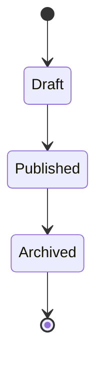

# Product Requirements Template

> **This template is mandatory for every Yugrow product before implementation begins.**
>
> No product enters development without an approved PRD using this template.
>
> Fill every section. If a section does not apply, explain why. "N/A" is not acceptable without justification.

---

## Product Identification

| Field | Value |
|-------|-------|
| **Product Name** | |
| **Version** | 1.0 |
| **PRD Author** | |
| **Owner** | |
| **Status** | Draft \| Review \| Approved \| Superseded |
| **Last Updated** | |
| **Target Release** | Alpha \| Beta \| RC1 \| v1 \| v2+ |
| **Related Documents** | |

---

## Section 1 — Product Overview

### 1.1 Purpose

> A single sentence describing what this product does. No jargon. No buzzwords. A user should understand it.

### 1.2 Business Problem

> What problem does this product solve? Why does it need to exist as a separate product rather than a feature of an existing one?

### 1.3 Target Users

> Who uses this product? Reference the customer profiles from the Product Strategy Bible.

### 1.4 Success Criteria

> How do we know this product is successful? Define measurable outcomes, not outputs.

| Criterion | Target | Measurement |
|-----------|--------|-------------|
| | | |

### 1.5 Scope

| In Scope | Out of Scope (Future) |
|----------|----------------------|
| | |

### 1.6 Dependencies

> Products, engines, or external services this product depends on.

| Dependency | Type | Status |
|------------|------|--------|
| | Engine \| Product \| External | |

### 1.7 Risks

> What could prevent this product from succeeding?

| Risk | Likelihood | Impact | Mitigation |
|------|-----------|--------|------------|
| | High \| Med \| Low | High \| Med \| Low | |

---

## Section 2 — User Personas

### 2.1 Primary Persona

| Attribute | Description |
|-----------|-------------|
| **Name** | A fictional name representing the persona |
| **Role** | |
| **Company Size** | |
| **Technical Level** | Low \| Medium \| High |
| **Goals** | What does this person want to achieve? |
| **Frustrations** | What prevents them from achieving it today? |
| **Frequency of Use** | Daily \| Weekly \| Monthly \| Event-driven |
| **Jobs To Be Done** | *When I\_\_\_, I want to \_\_\_, so I can \_\_\_.* |

### 2.2 Secondary Persona

| Attribute | Description |
|-----------|-------------|
| **Name** | |
| **Role** | |
| **Company Size** | |
| **Technical Level** | Low \| Medium \| High |
| **Goals** | |
| **Frustrations** | |
| **Frequency of Use** | |
| **Jobs To Be Done** | |

### 2.3 Additional Personas (if applicable)

> Document any additional personas with the same structure as above.

### 2.4 Non-Target Personas

> Who is explicitly NOT a target for this product? This prevents scope creep.

---

## Section 3 — User Stories

### 3.1 Epic: [Epic Name]

| ID | User Story | Acceptance Criteria | Priority | Dependencies |
|----|-----------|---------------------|----------|--------------|
| US-001 | As a **[persona]**, I want to **[action]** so that **[benefit]**. | 1. ... 2. ... 3. ... | P0 \| P1 \| P2 | |
| US-002 | | | | |

**Priority Definitions:**
- **P0**: Must have for release. Blocking.
- **P1**: Should have for release. High value.
- **P2**: Nice to have. Post-release or future iteration.

### 3.2 Epic: [Epic Name]

| ID | User Story | Acceptance Criteria | Priority | Dependencies |
|----|-----------|---------------------|----------|--------------|
| US-003 | | | | |

---

## Section 4 — Features

### 4.1 Feature: [Feature Name]

| Attribute | Description |
|-----------|-------------|
| **Description** | What does this feature do? |
| **Business Value** | Why does this feature matter? What metric does it move? |
| **UX Notes** | Key UX considerations, user flows, edge cases |
| **AI Opportunities** | How could AI enhance this feature? |
| **Engine Dependencies** | Which engines does this feature consume? |
| **Events Published** | What events does this feature emit? |
| **Events Consumed** | What events does this feature react to? |

### 4.2 Feature: [Feature Name]

| Attribute | Description |
|-----------|-------------|
| **Description** | |
| **Business Value** | |
| **UX Notes** | |
| **AI Opportunities** | |
| **Engine Dependencies** | |
| **Events Published** | |
| **Events Consumed** | |

---

## Section 5 — Data Model

### 5.1 Owned Objects

> Objects for which this product is the source of truth.

| Object | Description | Key Fields | Lifecycle |
|--------|-------------|------------|-----------|
| | | | |

### 5.2 Referenced Objects

> Objects owned by other products or engines that this product references.

| Object | Owner | Relationship |
|--------|-------|-------------|
| | | |

### 5.3 Source of Truth

> For every object across the platform, there is exactly one source of truth. Document which objects this product owns vs. references.

### 5.4 Lifecycle

> Describe the lifecycle of the primary owned objects — from creation through deletion or archival.

### 5.5 State Machine

> Document the valid states and transitions for each owned object.

### 5.6 Soft Delete Policy

| Object | Soft Delete | Retention Period | Hard Delete |
|--------|-------------|-----------------|-------------|
| | Yes \| No | | |

---

## Section 6 — APIs

### 6.1 REST Endpoints

| Method | Path | Description | Auth Required | Rate Limit | Idempotent |
|--------|------|-------------|---------------|------------|------------|
| GET | | | Yes \| No | | Yes \| No |
| POST | | | | | |
| PATCH | | | | | |
| DELETE | | | | | |

### 6.2 Events Published

> Events this product emits on the platform Event Bus.

| Event Type | Payload | Trigger | Consumers |
|------------|---------|---------|-----------|
| | | | |

### 6.3 Events Consumed

> Events this product subscribes to from other engines or products.

| Event Type | Source | Action Taken |
|------------|--------|-------------|
| | | |

### 6.4 Permissions / Capabilities

| Capability | Description | Default Role |
|------------|-------------|-------------|
| `{product}.{resource}.create` | | |
| `{product}.{resource}.read` | | |
| `{product}.{resource}.update` | | |
| `{product}.{resource}.delete` | | |

### 6.5 Error Codes

| HTTP Status | Error Code | Description | Recovery |
|-------------|------------|-------------|----------|
| 400 | | | |
| 401 | | | |
| 403 | | | |
| 404 | | | |
| 409 | | | |
| 422 | | | |
| 429 | | | |
| 500 | | | |

### 6.6 Versioning Strategy

> How will this API be versioned? (URL path, header, query parameter)

### 6.7 Pagination

> Default page size, max page size, cursor vs offset-based pagination.

---

## Section 7 — UI/UX

### 7.1 Required Screens

| Screen | Purpose | Primary Actions | Wireframe Reference |
|--------|---------|----------------|---------------------|
| | | | |
| | | | |

### 7.2 Navigation

> Where does this product live in the platform shell? Which sidebar section, which top-level nav item?

### 7.3 Widgets

> Which platform widgets does this product provide? (For the Widget Framework)

| Widget | Placement | Size | Refresh Interval |
|--------|-----------|------|-----------------|
| | | | |

### 7.4 Dashboards

> What dashboards does this product need? (Overview, per-workspace, per-user, admin)

### 7.5 Responsive Behavior

> How does this product behave on desktop, tablet, and mobile?

| Screen Size | Behavior |
|-------------|----------|
| Desktop (≥1024px) | |
| Tablet (768–1023px) | |
| Mobile (<768px) | |

### 7.6 Accessibility

| Requirement | Status | Notes |
|-------------|--------|-------|
| Keyboard navigation | | |
| Screen reader support | | |
| Color contrast (WCAG AA) | | |
| Focus management | | |
| Reduced motion support | | |

### 7.7 Design System Components

> Which YDL Design System components are used?

| Component | Usage |
|-----------|-------|
| Button | |
| Input | |
| Card | |
| Dialog | |
| Toast | |
| Skeleton | |
| EmptyState | |
| *Add others as needed* | |

### 7.8 Empty States

> What does every list, dashboard, and feed look like when there is no data? Every empty state is a design decision.

---

## Section 8 — Permissions

### 8.1 Capabilities

> Every action in the platform maps to a capability. List the capabilities this product introduces.

| Capability | Resource | Action | Description |
|------------|----------|--------|-------------|
| | | create \| read \| update \| delete \| admin | |

### 8.2 Default Roles

| Role | Included Capabilities | Description |
|------|----------------------|-------------|
| Admin | | Full access |
| Member | | Standard access |
| Viewer | | Read-only |
| *Custom* | | |

### 8.3 ABAC Rules

> Attribute-based access control rules. Conditions beyond role + capability.

| Rule | Condition | Effect |
|------|-----------|--------|
| | | Allow \| Deny |

### 8.4 Workspace Scope

> How does workspace isolation apply? Can users across workspaces interact? (e.g., trust evidence crosses workspace boundaries)

### 8.5 Organization Scope

> How does organization-level scoping apply?

### 8.6 Special Permissions

> Temporary grants, delegation, emergency access, audit overrides.

---

## Section 9 — AI

### 9.1 AI Features

| Feature | Description | Model | Latency Requirement |
|---------|-------------|-------|---------------------|
| | | | |

### 9.2 Prompt Templates

> For AI-powered features, document the prompt templates used. Prompts are versioned assets.

### 9.3 Approval Workflow

> Which AI actions require human approval before execution?

| Action | Requires Approval | Approver |
|--------|------------------|----------|
| | Yes \| No | |

### 9.4 Audit Requirements

> What AI actions must be logged for audit compliance?

### 9.5 Cost Controls

| Control | Limit | Action When Exceeded |
|---------|-------|---------------------|
| Per-user AI token cap | | |
| Per-workspace monthly cap | | |
| Model tier limits | | |

### 9.6 Fallback Behavior

> What happens when the AI model is unavailable, returns an error, or produces low-confidence output?

---

## Section 10 — Analytics

### 10.1 North Star Metric

> The single metric that best captures the value this product delivers to users.

| Metric | Definition | Target |
|--------|-----------|--------|
| | | |

### 10.2 Activation Metrics

| Event | Definition | Target Time |
|-------|-----------|-------------|
| | | |

### 10.3 Engagement Metrics

| Metric | Definition | Target |
|--------|-----------|--------|
| | | |

### 10.4 Retention Metrics

| Cohort | Target | Definition |
|--------|--------|------------|
| Day 1 | | |
| Day 7 | | |
| Day 30 | | |
| Day 90 | | |

### 10.5 Expansion Metrics

| Metric | Definition | Target |
|--------|-----------|--------|
| | | |

### 10.6 Operational KPIs

| KPI | Definition | Target | Alert Threshold |
|-----|-----------|--------|-----------------|
| API Latency (p95) | | | |
| Error Rate | | | |
| Uptime | | | |

### 10.7 Event Tracking

> Every meaningful user action should be tracked. List the key events.

| Event | Trigger | Properties |
|-------|---------|------------|
| | | |

---

## Section 11 — Testing

### 11.1 Unit Tests

| Area | Coverage Target | Notes |
|------|----------------|-------|
| Services | ≥90% | |
| Controllers | ≥80% | |
| Utils/Helpers | ≥95% | |

### 11.2 Integration Tests

| Test Scenario | Description |
|--------------|-------------|
| | |

### 11.3 API Tests

| Endpoint | Test Cases |
|----------|-----------|
| | Happy path \| Validation errors \| Auth errors \| Permission errors \| Rate limiting |

### 11.4 End-to-End Tests

| User Flow | Description |
|-----------|-------------|
| | |

### 11.5 Performance Tests

| Test | Baseline | Target |
|------|----------|--------|
| Response time (p50) | | |
| Response time (p95) | | |
| Response time (p99) | | |
| Concurrent users supported | | |
| Data volume threshold | | |

### 11.6 Security Tests

| Test | Required | Notes |
|------|----------|-------|
| OWASP Top 10 scan | Yes \| No | |
| Penetration test | Yes \| No | |
| Dependency vulnerability scan | Yes \| No | |
| Secrets scanning | Yes \| No | |

### 11.7 Accessibility Tests

| Standard | Required Level | Tool |
|----------|---------------|------|
| WCAG 2.1 | AA | |

---

## Section 12 — Release Checklist

> **Every item must be checked before a product can be released.**

### 12.1 Pre-Development

- [ ] Product Requirements Template completed and approved
- [ ] Architecture review completed
- [ ] Engine dependencies confirmed available
- [ ] Design System components identified
- [ ] Analytics events defined
- [ ] Feature flag created

### 12.2 During Development

- [ ] Unit tests passing (≥90% coverage)
- [ ] Integration tests passing
- [ ] API tests passing
- [ ] E2E tests passing
- [ ] Security scan passing
- [ ] Accessibility scan passing

### 12.3 Pre-Release

- [ ] UX review completed
- [ ] Performance review completed (meets targets)
- [ ] Security review completed
- [ ] Documentation completed
- [ ] Monitoring and alerting configured
- [ ] Error tracking configured
- [ ] Feature flag enabled (canary or phased rollout)
- [ ] Rollback plan documented
- [ ] Release notes written

### 12.4 Post-Release

- [ ] Activation metrics monitored (daily for first week)
- [ ] Error rate monitored (real-time alerting)
- [ ] Performance monitored (p95 latency, resource usage)
- [ ] User feedback collected
- [ ] Retrospective scheduled

### 12.5 Rollback Plan

| Trigger | Action | Estimated Time |
|---------|--------|---------------|
| Error rate > 1% | | |
| p95 latency > 2s | | |
| Critical bug reported | | |

### 12.6 Feature Flags

| Flag | Purpose | Owner | Expected Lifespan |
|------|---------|-------|-------------------|
| | | | |

---

## Approval

| Role | Name | Date | Decision |
|------|------|------|----------|
| Head of Product | | | Approved \| Changes Requested |
| Chief Architect | | | Approved \| Changes Requested |
| Engineering Lead | | | Approved \| Changes Requested |
| Security | | | Approved \| Changes Requested |

---

> **Once approved, this document becomes the single source of truth for what is being built.**
>
> Changes after approval require a version bump and re-approval from the Head of Product.
>
> **No code is written without an approved PRD.**
